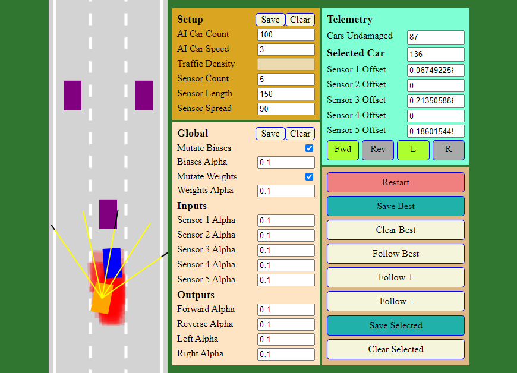

    <h1>
        Self Driving Car
    </h1>

    

    <h2>pure js, no imports</h2>
    <h3>just open index.html in a browser</h3>

    
save settings and best neural network to localstorage

    
manually adjust weights and biases

    
no evolution between runs yet

